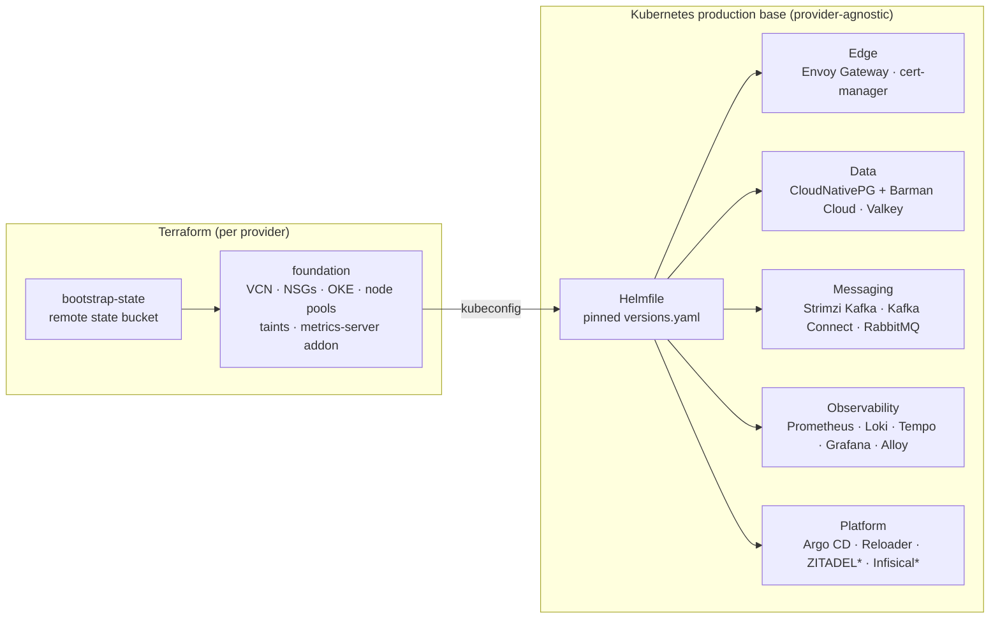

# Open Cluster Foundation

[](https://github.com/pyahu/open-cluster-foundation/actions/workflows/ci.yaml)
[](https://github.com/pyahu/open-cluster-foundation/releases)
[](LICENSE)
[](kubernetes/production-base/versions.yaml)

**Production-grade Kubernetes from zero:** cloud network, managed cluster,
ingress with TLS, full observability with dashboards and alerts, Kafka,
PostgreSQL with PITR backups, cache — every version pinned, every manifest
validated against real CRD schemas in CI.

OCI/OKE is the first implemented provider. The structure is intentionally
multi-provider: the Kubernetes base is provider-agnostic, so Magalu Cloud,
DigitalOcean and others can be added without touching it.

Maintained by [Pyahu](https://github.com/pyahu) for the community. It does not
install the Pyahu platform — these are reusable building blocks for anyone who
needs an operable cluster, not a starting point for vendor lock-in.

## Architecture



\* optional profiles.

Every component version is pinned in
[`versions.yaml`](kubernetes/production-base/versions.yaml), updated by
Renovate and verified by CI: Terraform is validated and linted for every
stack, the entire Helmfile render plus every custom resource is
schema-checked with kubeconform against upstream CRD schemas, and an
end-to-end suite installs the full base on a disposable kind cluster and
asserts real traffic flows through the edge. The full
component matrix lives in the
[Kubernetes base README](kubernetes/production-base/README.md#component-matrix).

These modules are starting points, not a production guarantee. Review them for
your compliance, security, networking, backup and cost requirements before
running critical workloads.

## Quickstart (OCI)

The map below is the whole journey — what to read, what to edit and what to
run at each step, from an empty OCI tenancy to a running production base:

| # | Step | Read | Edit | Run |
| --- | --- | --- | --- | --- |
| 0 | Toolchain | this README | — | `mise trust && mise install && mise run doctor` |
| 1 | OCI API key, profile, compartment, IAM | [bootstrap-state §1–2](terraform/oci/bootstrap-state/README.md#1-oci-credentials) | `~/.oci/config` | `oci os ns get --profile <profile>` |
| 2 | Remote Terraform state | [bootstrap-state §3](terraform/oci/bootstrap-state/README.md#3-create-the-state-bucket) | `terraform/oci/bootstrap-state/terraform.tfvars` | `mise run oci:state:plan`, then `oci:state:apply -- --yes` |
| 3 | Discover cluster inputs (OKE version, node image, your IP) | [foundation §3](terraform/oci/foundation/README.md#3-discover-oci-values) | — | `oci ce cluster-options get ...` |
| 4 | Provision the OKE foundation | [foundation §5](terraform/oci/foundation/README.md#5-configure-variables) | `terraform/oci/foundation/terraform.tfvars` | `mise run oci:cluster:plan`, then `oci:cluster:apply -- --yes` |
| 5 | Kubeconfig | [foundation §7](terraform/oci/foundation/README.md#7-generate-kubeconfig) | — | `mise run oci:kubeconfig` |
| 6 | Kubernetes production base | [production-base README](kubernetes/production-base/README.md) | — | `mise run k8s:base:check`, then `k8s:base:apply -- --yes` |
| 7 | Network Load Balancer, DNS, HTTPS listeners and redirect | [production-base §7](kubernetes/production-base/README.md#7-install-the-default-foundation) | `resources/oci/envoyproxy-nlb.yaml` (LB NSG OCID), `resources/cert-manager/gateway-https-listener.yaml` (your domains) | `kubectl apply -f ...` |
| 8 | Backups, Debezium and other stateful add-ons | [production-base §8](kubernetes/production-base/README.md#8-apply-stateful-resources) | copies of `kubernetes/production-base/resources/*` | `kubectl apply -f ...` |
| 9 | Optional ZITADEL and Infisical | [production-base §9–10](kubernetes/production-base/README.md#9-optional-zitadel) | `values/zitadel.yaml`, `values/infisical.yaml` (your domains) | `mise run k8s:base:apply -- --environment all-components --yes` |

The only files you ever edit are `~/.oci/config`, the two `terraform.tfvars`
(copied from the committed `.example` files), the domain placeholders in the
Kubernetes resources and the gitignored `values/local/*.yaml` overrides for
instance-specific settings such as the Grafana public URL and OIDC issuer.
Everything else is read-only.

Install the pinned toolchain and check prerequisites:

```sh
mise trust
mise install
mise run doctor
```

**1. Bootstrap remote Terraform state:**

```sh
cp terraform/oci/bootstrap-state/terraform.tfvars.example \
  terraform/oci/bootstrap-state/terraform.tfvars
${EDITOR:-vi} terraform/oci/bootstrap-state/terraform.tfvars

mise run oci:state:plan
mise run oci:state:apply -- --yes   # writes terraform/oci/foundation/backend.hcl
```

**2. Provision the OKE foundation:**

```sh
cp terraform/oci/foundation/terraform.tfvars.example \
  terraform/oci/foundation/terraform.tfvars
${EDITOR:-vi} terraform/oci/foundation/terraform.tfvars

mise run oci:cluster:plan
mise run oci:cluster:apply -- --yes
```

**3. Generate kubeconfig:**

```sh
mise run oci:kubeconfig
export KUBECONFIG="$HOME/.kube/<cluster-name>.yaml"
kubectl get nodes
```

**4. Apply the Kubernetes production base:**

```sh
mise run k8s:base:check
export ACME_EMAIL="platform@example.com"   # optional; enables Let's Encrypt issuers
mise run k8s:base:apply -- --yes
```

After the base is installed, point DNS at the Envoy Gateway load balancer,
replace the example domains and follow the
[Kubernetes base README](kubernetes/production-base/README.md) for HTTPS
listeners, backups, ZITADEL and Infisical. The optional profiles are enabled
with:

```sh
mise run k8s:base:apply -- --environment all-components --yes
```

## Private cluster instances

For a real customer or project cluster, keep the public module and put the
instance values in an ignored local directory (or a private repository), so
real OCIDs, allowlisted IPs and DNS names never reach Git:

```sh
mise run oci:instance:new -- <instance-name>
cd .local/instances/<instance-name>/terraform
cp backend.hcl.example backend.hcl && cp terraform.tfvars.example terraform.tfvars
${EDITOR:-vi} backend.hcl terraform.tfvars

mise run oci:instance:plan -- <instance-name>
mise run oci:instance:apply -- <instance-name> --yes
mise run oci:instance:kubeconfig -- <instance-name>
```

The template starts with a small production-shaped foundation: 3 worker plus
2 database nodes (VM.Standard.E5.Flex, 2 OCPU / 24 GB each), with the database
pool tainted at node registration.

## Support matrix

| What | Status |
| --- | --- |
| Kubernetes (base layer) | `v1.30+` on any conformant cluster with a default StorageClass |
| OKE (foundation) | `ENHANCED_CLUSTER`, VCN-native pod networking, tested with `v1.35.x` |
| Component versions | Pinned in [`versions.yaml`](kubernetes/production-base/versions.yaml), checked `2026-06-26`, kept current by Renovate |
| Toolchain | Pinned in [`mise.toml`](mise.toml) |

## Why not ...?

- **[terraform-oci-oke](https://github.com/oracle-terraform-modules/terraform-oci-oke)**:
  excellent and far more featureful, but large and opinionated about owning
  your network. This module is intentionally small enough to read in one
  sitting — and the cluster is only half the problem; the service layer on top
  is where most of this repository lives.
- **Homelab cluster templates** (Talos/Flux ecosystems): great for self-hosted
  bare metal. This project targets managed clouds, cloud-native storage and
  defaults you can defend in a production review.
- **kubespray / kOps**: cluster installers. Here the cloud's managed control
  plane does that job; the value is everything that comes after `kubectl get
  nodes` works.

## Roadmap

- Magalu Cloud and DigitalOcean foundations (same inputs/outputs contract).
- NetworkPolicy default-deny profile for the base namespaces.
- Cluster Autoscaler / Karpenter as foundation options.
- Terraform Registry publication of the OKE foundation module.

Issues and discussions are open — multi-provider support is exactly the kind
of work that benefits from community hands.

## Repository layout

| Layer | Provider | Path | Status |
| --- | --- | --- | --- |
| Terraform foundation | OCI | [`terraform/oci/bootstrap-state`](terraform/oci/bootstrap-state/README.md) | Implemented |
| Terraform foundation | OCI | [`terraform/oci/foundation`](terraform/oci/foundation/README.md) | Implemented |
| Terraform foundation | Magalu Cloud | `terraform/magalu/*` | Planned |
| Terraform foundation | DigitalOcean | `terraform/digitalocean/*` | Planned |
| Terraform modules | Provider-specific | [`terraform/modules`](terraform/modules) | Implemented |
| Kubernetes base | Any conformant cluster | [`kubernetes/production-base`](kubernetes/production-base/README.md) | Implemented |
| Instance template | OCI | [`templates/oci-foundation-instance`](templates/oci-foundation-instance/README.md) | Implemented |

## Automation with mise

[`mise.toml`](mise.toml) pins the toolchain and exposes small task
entrypoints; the real work lives in [`scripts/`](scripts), so everything can
be inspected and run without mise.

<details>
<summary>All tasks (<code>mise tasks</code>)</summary>

| Task | Purpose |
| --- | --- |
| `mise run doctor` | Check local tools. |
| `mise run oci:state:plan` / `oci:state:apply -- --yes` | Plan/apply the OCI state bucket and write `backend.hcl`. |
| `mise run oci:state:backend` | Regenerate `backend.hcl` from the bootstrap-state output. |
| `mise run oci:cluster:plan` / `oci:cluster:apply -- --yes` | Plan/apply the OCI OKE foundation. |
| `mise run oci:kubeconfig` | Generate kubeconfig from Terraform output. |
| `mise run oci:instance:new -- <name>` | Create an ignored private OCI foundation instance. |
| `mise run oci:instance:plan/apply/kubeconfig -- <name>` | Manage a private instance. |
| `mise run k8s:base:check` | Preflight checks against the current context. |
| `mise run k8s:base:render` | Render the Kubernetes base with Helmfile. |
| `mise run k8s:base:apply -- --yes` | Apply the Kubernetes base to the current context. |
| `mise run k8s:nodes:taint-database -- --yes` | Retrofit labels/taints on pre-existing database nodes. |
| `mise run ci:scripts` / `ci:terraform` / `ci:kubernetes` | Run the CI checks locally. |

Apply tasks ask for interactive confirmation unless `--yes` is passed after
`--`, or `OCF_AUTO_APPROVE=true` is exported. The tasks never create real
`terraform.tfvars` files and never commit secrets.

</details>

## Principles

- Remote state from the first real cluster.
- No committed secrets.
- Predictable resource names.
- Small modules with typed, documented variables.
- Private nodes by default; public API access only through explicit CIDRs.
- Cluster add-ons are separate from cloud provisioning.
- Provider modules should expose comparable inputs and outputs where possible.
- The Kubernetes base must stay provider-agnostic.

## Contributing

See [CONTRIBUTING.md](CONTRIBUTING.md) for the development setup, CI checks
and the checklists for adding components and providers. Security reports go
through [SECURITY.md](SECURITY.md).

Licensed under the [MIT License](LICENSE).
