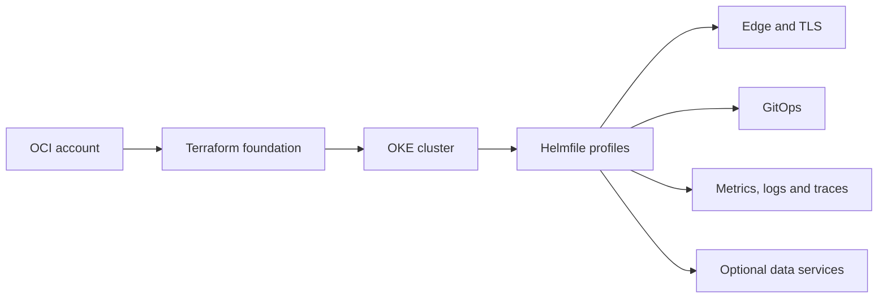

# Open Cluster Foundation

[](https://github.com/pyahu/open-cluster-foundation/actions/workflows/ci.yaml)
[](https://github.com/pyahu/open-cluster-foundation/releases)
[](LICENSE)
[](docs/reference/compatibility.md)
[](https://open-cluster-foundation.terson.workers.dev)

Open Cluster Foundation, or OCF, provides readable building blocks for creating
and operating a Kubernetes foundation. It combines Terraform, Helmfile and a
small set of `mise` tasks so operators can review every change before applying
it.

OCI OKE is the only cloud foundation implemented today. The Kubernetes layer is
kept separate from the cloud module so more providers can be added without
forking the cluster services.

## What you get

OCF covers two layers:

- **Cloud foundation:** network, private OKE API, Bastion access, node pools,
  security rules and remote Terraform state.
- **Kubernetes foundation:** ingress, TLS, GitOps, metrics, logs, traces,
  dashboards and alerts. Optional profiles add database, messaging, cache,
  identity and secrets operators.

It does not install an application platform or hide the underlying tools. The
Terraform plans, Helm values and Kubernetes resources remain available for
review and adaptation.

| Current support | Status |
| --- | --- |
| Cloud | OCI OKE implemented |
| Kubernetes | Designed for 1.30 or newer, tested end to end on 1.36.1 |
| Other clouds | Magalu Cloud and DigitalOcean planned |
| License | MIT |

See the generated [compatibility reference](docs/reference/compatibility.md)
for the exact evidence behind these statements.

## How it fits together



Terraform owns cloud resources. Helmfile owns the selected cluster services.
Example custom resources show how to add workloads such as PostgreSQL, Kafka
and RabbitMQ without making them mandatory for every cluster.

## Start safely

Use a tested release instead of `main` for a real installation:

```sh
git clone --branch v2026.9.0 --depth 1 \
  https://github.com/pyahu/open-cluster-foundation.git
cd open-cluster-foundation
mise trust
mise install
mise run doctor
```

The normal workflow is short:

1. Bootstrap remote Terraform state.
2. Review the OCI foundation plan.
3. Apply the reviewed plan.
4. Generate a dedicated kubeconfig.
5. Check and render the Kubernetes base.
6. Apply the selected profile.

Follow the [getting started guide](docs/README.md) for the commands and the
files you need to provide. Do not run an apply task until the target account,
Terraform plan and Kubernetes context are correct.

## Command surface

The project uses `mise` as the entrypoint for both the pinned toolchain and the
common workflows.

```sh
mise tasks
```

The tasks are grouped by intent:

| Intent | Tasks |
| --- | --- |
| Check the workstation | `doctor` |
| Manage remote state | `oci:state:plan`, `oci:state:apply` |
| Manage the OKE foundation | `oci:cluster:plan`, `oci:cluster:apply`, `oci:kubeconfig` |
| Manage a private instance | `oci:instance:new`, `oci:instance:plan`, `oci:instance:apply`, `oci:instance:kubeconfig` |
| Inspect the Kubernetes base | `k8s:base:check`, `k8s:base:render` |
| Install the Kubernetes base | `k8s:base:apply` |
| Build, run or publish the website | `site:build`, `site:dev`, `site:deploy` |
| Run project checks | `ci:docs`, `ci:site`, `ci:scripts`, `ci:terraform`, `ci:kubernetes`, `ci:supply-chain`, `ci:e2e` |

Apply tasks require `--yes` or interactive confirmation. The Kubernetes
preflight also checks whether the current cluster is fresh, managed by OCF or a
legacy installation that needs a compatible upgrade path.

Read the [CLI guide](docs/cli.md) for flags, profiles and examples.

## Choose the right profile

| Profile | Use it for |
| --- | --- |
| `starter` | A small first installation with edge, TLS, GitOps and observability |
| `production` | The control plane plus database and messaging operators |
| `production-ha` | Failure tolerant services with durable observability |
| `production-data` | Production plus Kafka, Kafka Connect and Valkey support |
| `all-components` | Explicit evaluation of every optional component |

Profiles are installation choices, not automatic capacity decisions. Review
[capacity and cost planning](docs/capacity-planning.md) before using the high
availability or stateful profiles.

## Documentation

Start with the guide that matches your goal:

| Goal | Guide |
| --- | --- |
| Understand the project | [Documentation home](docs/README.md) |
| Learn the commands | [CLI and toolchain](docs/cli.md) |
| Run or publish the website | [Website deployment](docs/site.md) |
| Create an OCI foundation | [OCI foundation](terraform/oci/foundation/README.md) |
| Install cluster services | [Kubernetes production base](kubernetes/production-base/README.md) |
| Upgrade an existing cluster | [Compatibility and migrations](docs/compatibility.md) |
| Plan high availability | [Production HA](docs/production-ha.md) |
| Operate, recover or uninstall | [Lifecycle](docs/lifecycle.md) |
| Understand design choices | [Implementation decisions](docs/implementation-decisions.md) |
| Add another cloud | [Provider contract](docs/provider-contract.md) |

Component versions and compatibility tables are generated from the same
machine readable sources used by the installer. Run `mise run docs:generate`
after changing those sources.

## What OCF does not claim

- It is not multi cloud yet. Only OCI has an implemented Terraform module.
- A passing test suite does not replace a review of security, cost, recovery
  objectives or local compliance requirements.
- Example stateful resources need sizing, credentials and retention policies
  chosen for the workload.
- The standalone Terraform Registry module is not published. Pin a project
  release through the Git source until the provider contract says otherwise.

These limits are intentional and visible so teams can decide whether OCF fits
their environment.

## Contributing

Contributions should keep the command surface small, preserve safe defaults and
include evidence appropriate to the change. Read [CONTRIBUTING.md](CONTRIBUTING.md)
before opening a pull request.

Open Cluster Foundation is maintained by [Pyahu](https://github.com/pyahu) and
released under the [MIT License](LICENSE).
